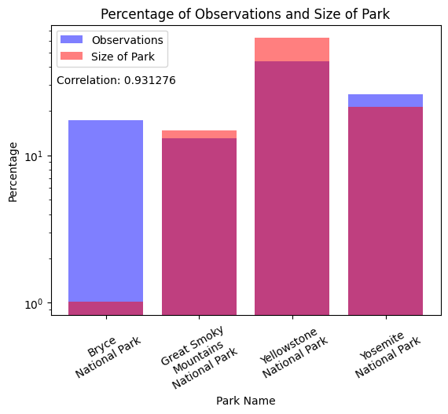
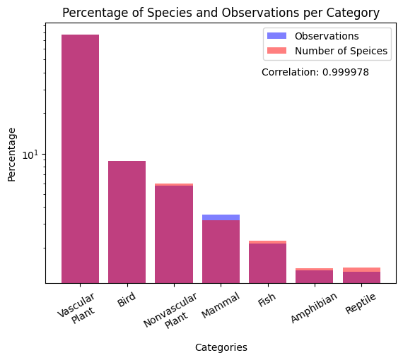
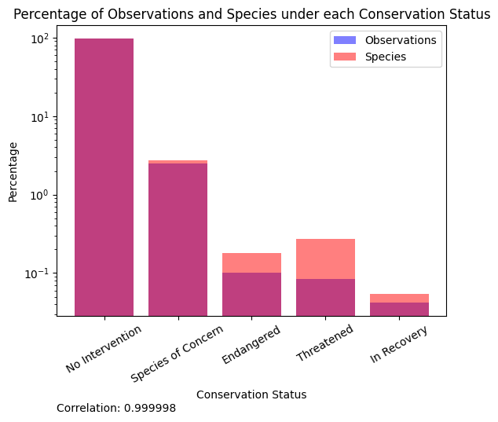
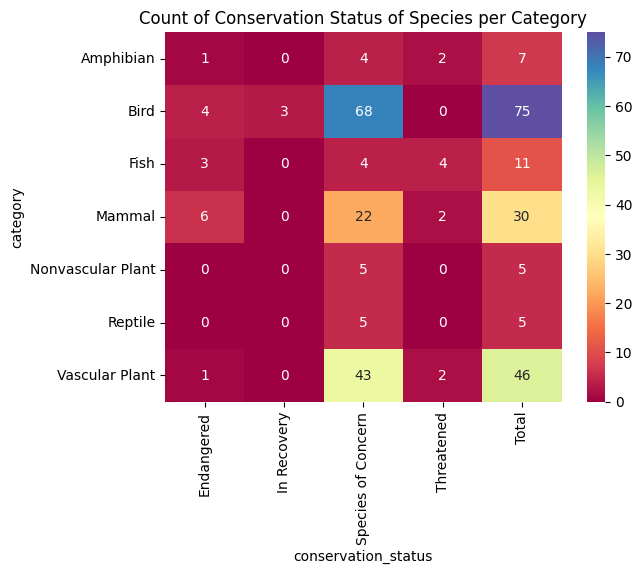
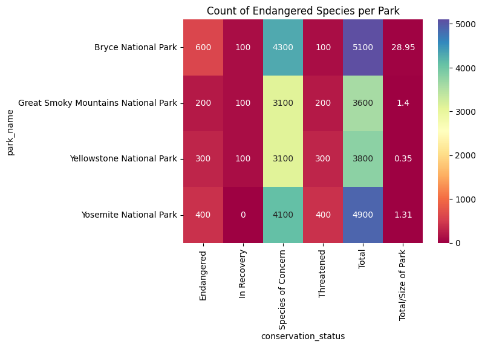
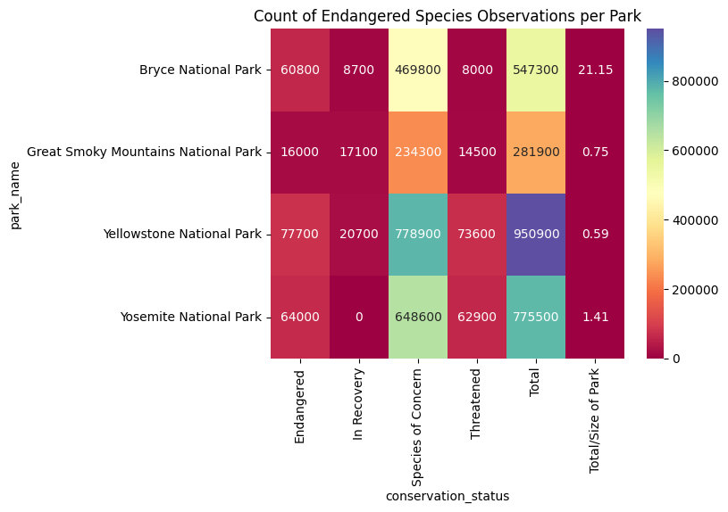
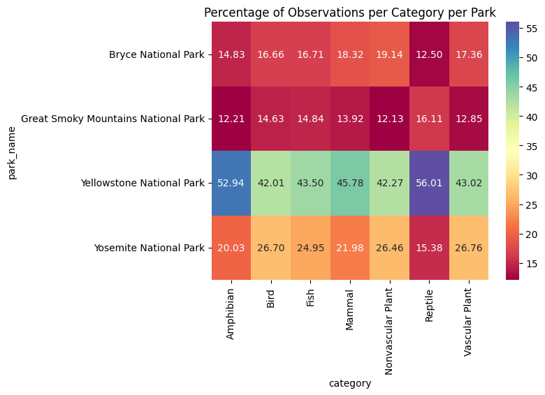

# Biodiversity in National Parks Data Exploration and Analysis

In this file I will explore the data and try to answer some questions about the biodiversity in National Parks. I will use the following datasets:  
- `observations.csv`
- `species_info.csv`

## Problem Definition

There are many species observed within the national parks, some of them are endangered. I will try to analyze the data and attempt to find statistical insights about the conservation status of these species in relation to the parks and categories they belong to.

## Analysis

[Descriptive](#descriptive-analysis):

- What is the distribution of conservation status for species?
- What is the park that has the most endangered species?
- What is the most common species in each park?

[Exploratory](#exploratory-analysis):

- Is there a correlation between multiple types of species and their conservation status?
- Is there a correlation between the park and the conservation status of the species?
- Is there a correlation between the category and the conservation status of the species?

Inferential:

- What is the probability of a species being endangered for each category?
- What is the probability of a species being endangered for each park?
- What is the probability of a species being endangered for each category and park?

Predictive:

- Can we predict the conservation status of a species based on its category, park, and observations?

## Observing the data  

I will start by loading the data and exploring the first few rows of each dataset.

Observing these datasets we can assume that the structure of the data is as follows:
- observations.csv:  

|Key|Name|Type|Description|
|---|---|---|---|
|*|scientific_name| String | The scientific name of the species (foreign key)|
|*| park_name | String | The name of the national park where the species was observed |
|| Observations | Int | The number of times the species was observed in the park |

- species_info.csv:

|Key|Name|Type| Description|
|---|---|---| ---|
|| category | String | The category of the species (mammal, bird, reptile, etc.) |
|*| scientific_name | String | The scientific name of the species (primary key)|
|| common_names | String | The common names of the species |
|| conservation_status | String | The species conservation status |

After some consolidating of the data by merging rows with the same scientific name, we can see that the scientific name is the unique identifier for the species in both datasets.

#### General Observations

#### - There are 4 national parks in the data
  - each park has the same number of records in observations 
#### - There are 7 categories of species
  - the most common category is Vascular Plant
#### - There are 4 conservation statuses
  - the most common status is 'No Intervention'

#### Deeper Observations
*TODO: make them side by side*

#### - Yellowstone has the most observations
  - Is this due to the size of the park?
  - While the correlation value is high we can see that Bryce national park does not match the trend
  - 
#### - Vascular Plant has the most observations
  - Is this due to the number of species in this category?
  - The correlation value is high, and the trend is also clear, I can conclude that the number of observations is directly proportional to the number of species in each category
  - The more species that there are in a category, the more chances to observe
  - 
#### - the number of observations per observation status matches the same distribution as the number of species in each status
  - 
                                                                
## Descriptive Analysis

### 1. What is the distribution of conservation status for each species?
  - With 'No Intervention' removed from the data, we can see more clearly using the total column that bird species are the most endangered with 75 species having a non 'No Intervention' status.
  - Mammals have the most species in the 'Endangered' status
  - 
### 2. what is the park that has the most endangered species?
  - From this graph we can see that Bryce national park has the most endangered species and with its relatively small size, it has the highest percentage of endangered species. 
  - 
  - Using the observation count for each species we can see that Yellowstone has the most observations of endangered species, however, as the park is the largest, the percentage of endangered species is the lowest.
  - Bryce national park still has the highest percentage of endangered species by observation count.
  - 
### 3. what is the most common species in each park?
  - The most common species for each park is as follows:

|Park Name|Observation Count|Scientific Name|Category|Common Name|Conservation Status|
|---|---|---|---|---|---|
|Bryce National Park| 339 | Columba livia | Bird | Rock Dove | No Intervention |
|Great Smoky Mountains National Park| 256 | Streptopelia decaocto | Bird | Eurasian Collared-Dove | No Intervention |
|Yellowstone National Park| 805 | Holocus lanatus | Vascular Plant | Common Velvet Grass | No Intervention |
|Yosemite National Park| 505 | Hypochaeris radicata | Vascular Plant | False Dandelion | No Intervention |
  - the most common species that has a non 'No Intervention' status for each park:

|Park Name|Observation Count|Scientific Name|Category|Common Name|Conservation Status|
|---|---|---|---|---|---|
|Bryce National Park| 298 | Myotis lucifugus | Mammal | Little Brown Bat | Species of Concern |
|Great Smoky Mountains National Park| 174 | Myotis lucifugus | Mammal | Little Brown Bat | Species of Concern |
|Yellowstone National Park| 679 | Myotis lucifugus | Mammal | Little Brown Bat | Species of Concern |
|Yosemite National Park| 396 | Myotis lucifugus | Mammal | Little Brown Bat | Species of Concern |
### 4. what are the least common species in each park?
  - The least common species for each park is as follows:

|Park Name|Observation Count|Scientific Name|Category|Common Name|Conservation Status|
|---|---|---|---|---|---|
|Bryce National Park| 9 | Corydalis aurea | Vascular Plant | Golden Corydalis | No Intervention |
|Great Smoky Mountains National Park| 10 | Collomia tinctoria | Vascular Plant | Yellow-staining Collomia | No Intervention |
|Yellowstone National Park| 57 | Grus americana | Bird | Whooping Crane | Endangered |
|Yosemite National Park| 31 | Noturus baileyi | Fish | Smoky Madtom | Endangered |

To sum up this section, this is a graph showing the distribution of categories in each park:

## Exploratory Analysis

### 1. Is there a correlation between multiple types of species and their conservation status?

### 2. Is there a correlation between the park and the conservation status of the species?

### 3. Is there a correlation between the category and the conservation status of the species?
