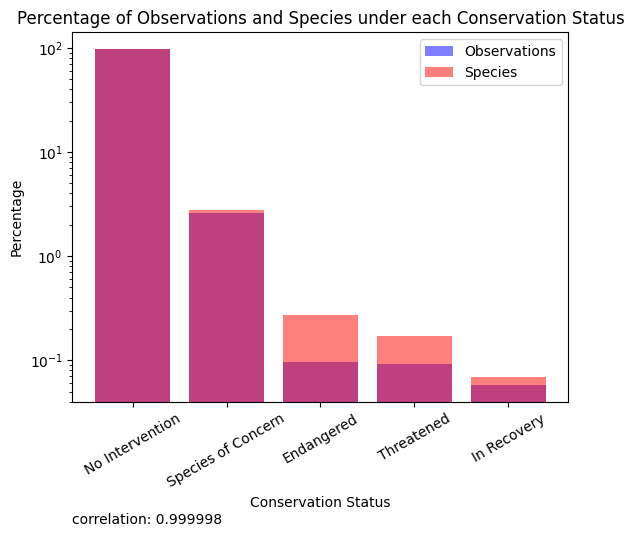

# Biodiversity in National Parks Data Explration and Analysis

In this file I will explore the data and try to answer some questions about the biodiversity in National Parks. I will use the following datasets:  
- `observations.csv`
- `species_info.csv`

## Problem Defenition

There are many speicies observed within the national parks, some of them are endagered. I will try to analyse the data and attemt to find statistical insights about the conservational sataus of these species in relation to the parks and categories they belong to.

## Analysis

Descriptive:

- What is the distribution of conservation status for species?
- what is the park that has the most endangered species?
- what is the category that has the most endangered species?
- what is the most common species in each park?

Exploratory:

- is there a correlation between multiple types of speiceis and their conservation status?
- is there a correlation between the park and the conservation status of the species?
- is there a correlation between the category and the conservation status of the species?

Inferential:

- what is the probability of a species being endangered for each category?
- what is the probability of a species being endangered for each park?
- what is the probability of a species being endangered for each category and park?

Predictive:

- can we predict the conservation status of a species based on its category, park, and observations?

## Observing the data  

I will start by loading the data and exploring the first few rows of each dataset.

Observing these datasets we can assume that the structure of the data is as follows:
- observations.csv:  

|Key|Name|Type|Description|
|---|---|---|---|
|*|scientific_name| String | The scientific name of the species (foreign key)|
|*| park_name | String | The name of the national park where the species was observed |
|| Observations | Int | The number of times the species was observed in the park |

- species_info.csv:

|Key|Name|Type| Description|
|---|---|---| ---|
|| category | String | The category of the species (mammal, bird, reptile, etc.) |
|*| scientific_name | String | The scientific name of the species (primary key)|
|| common_names | String | The common names of the species |
|| conservation_status | String | The species conservation status |

after some consolodating of the data by merging rows with the same scientific name, we can see that the scientific name is the unique identifier for the species in both datasets.

#### General Observations

- There are 4 national parks in the data
  - each park has the same number of records in observations 
- There are 7 categories of species
  - the most common category is Vascular Plant
- There are 4 conservation statuses
    - the most common status is 'No Intervention'

#### Deeper Observations
TODO: make them side by side
- yellowstone has the most observations
  - is this due to the size of the park?
  - while the correlation value is high we can see that Bryce national park does not match the trend
  - 
- vascular plant has the most observations
  - is this due to the number of species in this category?
  - the correlation value is high and the trend is also clear, i can conclude that the number of observations is directly proportional to the number of species in each category
  - the ,pre speices that there are in a category, the more chances to observe
  - 
- the number of observations per observation status matches the same distribution as the number of species in each status
  - 
                                                                
## Descriptive Analysis

1. What is the distribution of conservation status for species?
2. what is the park that has the most endangered species?
3. what is the category that has the most endangered species?
4. what is the most common species in each park?